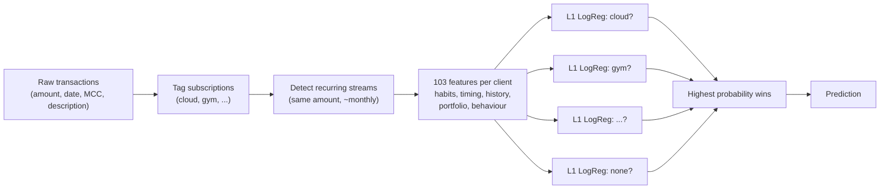

# Next Recurring Merchant Forecast (UBS, Swiss AI Week 2026)

**Task:** for each bank client, predict which subscription family recurs next
in the 90 days after `2026-01-01`: `cloud, gym, insurance, mobile, music,
software, streaming` or `none`. Metric: macro-F1.

**Idea:** find the right features, keep the model lean, make the forecast
understandable.

## How the model works



1. **Expand features:** from raw transactions we build 103 readable features,
   e.g. "recent gym payments", "is the insurance still running", "which
   subscription is due first", "does the client travel".
2. **One sparse model per label:** for each of the 8 labels a separate
   L1 (lasso) logistic regression answers "is it this label, yes or no?".
   The L1 penalty keeps only the features that matter for that label.
3. **Pick the label** with the highest probability.

Because every label has its own short list of coefficients, each prediction
can be explained, e.g. *gym is likely because of recent gym payments and a
long-running gym subscription*.

## Results (macro-F1 on the validation set)

| Model | Macro-F1 |
|---|---|
| **Our model (sparse per-label L1 LogReg)** | **0.513** |
| One global logistic regression | 0.489 |
| Simple rule: "subscription due first" | 0.484 |

Trained on 2,000 labelled clients plus 3,152 pseudo-labelled extra clients.

## What drives the forecast

| Feature block | Importance |
|---|---|
| Subscription status & timing (still live? due first? trial?) | 22.5 |
| Habits (recent payments per family) | 13.5 |
| Subscription history (age, charges, amount) | 4.4 |
| Portfolio changes & refunds | 3.6 |
| Account behaviour (payment mix, top-ups, travel) | 2.9 |

Importance = macro-F1 points lost when the block is removed.

## Run it

```bash
pip install -e .                      # Python >= 3.10
unzip data/dataset.zip -d data/
py -3.10 -m src.evaluate "my run"     # score on validation
py -3.10 -m src.make_submission sparse --features lean --pseudo --suffix final
```

## Repository

```
src/          pipeline code (tagging, streams, features, model, evaluation, submission)
data/         challenge data (dataset.zip) + pseudo-labels
extra_info/   experiment log, verified interpretations, coefficients per label
```

Challenge data and task: [Swiss-ai-Weeks/ubs-2026](https://github.com/Swiss-ai-Weeks/ubs-2026)
(Apache 2.0).
