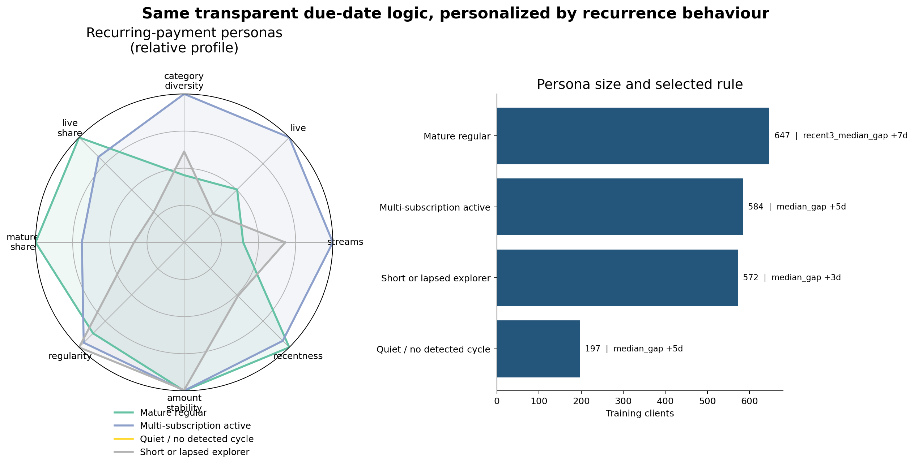

# Recurrence-behaviour personas

This experiment asks whether the same transparent due-date model should use
slightly different timing rules for different kinds of recurring-payment
clients.  It deliberately uses **recurrence behaviour only**—not income,
demographics, total spending, or the target label—to form the personas.

## Result

| Rule | Validation macro-F1 | Delta vs global median |
|---|---:|---:|
| Original global mean-gap rule | 0.484420 | -0.012432 |
| **Global median-gap rule** | **0.496853** | — |
| Recurrence-persona rules | 0.487847 | -0.009006 |

The personas are coherent and easy to present, but their personalized rules
do not beat the global median-gap rule.  The recommended predictive model
therefore remains the global median rule.  This is a useful finding: who a
client is behaviourally can be described with profiles, while billing cadence
is still estimated more reliably by pooling everyone under one robust rule.

The persona model does improve on the original mean-gap baseline by 0.003427,
but the simpler global median rule improves by much more.

## The four personas

The profiles were obtained using K-means (`k=4`, seed 31) on eight standardized
client-level features.  Count features are `log1p` transformed before scaling.

| Persona | Train clients | Interpretation | Selected rule |
|---|---:|---|---|
| Mature regular | 647 (32.4%) | Mostly live, long-running cycles | Recent-three-gap median, 7-day grace, keep short-stream gate |
| Multi-subscription active | 584 (29.2%) | Many live streams across several families | Global median, 5-day grace, keep short-stream gate |
| Short or lapsed explorer | 572 (28.6%) | Several detected streams, but few are live or mature | Global median, 3-day grace, remove short-stream gate |
| Quiet / no detected cycle | 197 (9.9%) | No categorized recurring stream detected | Global fallback: median, 5-day grace |



The radar chart is relative: each dimension is min-max scaled across the four
persona centroids.  The quiet profile is correctly at zero on every recurrence
dimension, so its radar polygon collapses to the centre.

## Features used to form personas

- number of detected recurring streams;
- number of live streams;
- number of distinct recurring categories;
- share of streams still live;
- share of mature streams with at least five observations;
- timing regularity (`1 - normalized median gap CV`);
- amount stability (`1 - normalized median amount CV`);
- recentness (`exp(-median recency / 90)`).

All features are computed from transactions available before the prediction
cutoff.  No label is used to create or name a cluster.

## Leakage-safe selection

The global fallback is fixed in advance as median gap plus five days of grace.
For each persona, candidate cadence estimators, grace windows, and the existing
short-stream gate are compared using only training labels.  A persona change
must improve average macro-F1 across five fixed stratified training folds, be
positive in at least three of the five folds, and clear a small minimum-gain
threshold.  Otherwise it inherits the global fallback.

Validation labels are behind the explicit `--final-validation` flag and were
evaluated once, after the clustering and rule choices were frozen.  The result
is recorded in `results.json`; `validation_predictions.csv` is retained for
auditability.

## What we learned

1. **The segmentation is real and interpretable.** The four groups have very
   different stream count, maturity, liveness, and recentness profiles.
2. **Individualization slightly overfit.** Training macro-F1 rose from
   0.503286 to 0.505699, but held-out macro-F1 fell by 0.009006 versus the
   global median rule.
3. **Robust cadence matters more than persona identity.** Median gaps help
   broadly because delayed or skipped payments are outliers in every persona.
4. **Personas are still valuable for storytelling and diagnostics.** They can
   show where detection fails or where cancellations concentrate without being
   allowed to weaken the production prediction rule.

The defensible deployment design is therefore:

```text
persona = recurrence profile (for explanation / monitoring)
prediction = global median-gap due-date rule (for accuracy)
fallback = the same global median rule when a profile is absent or uncertain
```

## Reproduce

From the repository root:

```bash
# Personas and train-only rule selection; does not read validation labels.
py -3.10 models/rule_based/experiments/personas/recurrence_personas/experiment.py

# Locked final evaluation. Do not use this flag for model selection.
py -3.10 models/rule_based/experiments/personas/recurrence_personas/experiment.py --final-validation
```

Artifacts:

- `persona_profiles.csv`: raw centroids, sizes, and selected rules;
- `persona_profiles_normalized.csv`: visualization-scale centroids;
- `persona_profiles.png` and `.svg`: presentation-ready profile chart;
- `train_rule_selection.csv`: complete train-only selection audit;
- `validation_predictions.csv`: final held-out predictions;
- `results.json`: configuration and final scores.
