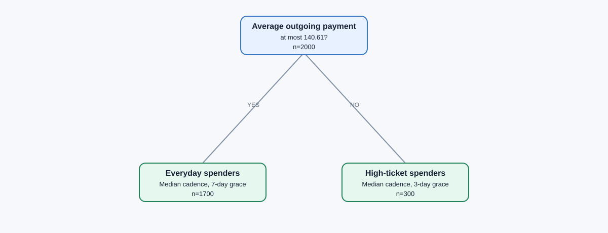

# Supervised spender personas

## Outcome

The idea is attractive and easy to present, but this experiment says **do not
replace the global median-gap rule with spender personas yet**.

| Locked model | Validation macro-F1 | Delta vs original |
|---|---:|---:|
| Original global mean-gap rule | 0.484420 | — |
| **Global median-gap rule** | **0.496853** | **+0.012432** |
| Supervised two-persona router | 0.491660 | +0.007240 |

The persona router beats the original rule, but trails the global median rule
by `0.005193`. The train-only evidence points in the same direction: its best
five-fold out-of-fold score is `0.501798`, versus `0.503286` when the same
median/5-day rule is simply applied to every training client.

This is still a useful learning: **how much a client spends does influence the
best grace period, but not reliably enough to justify separate production
rules on this sample.** Median cadence is the robust signal; persona-specific
thresholds are second-order.

## The learned personas



The final tree was locked using training data before validation was loaded.

| Persona | Explicit definition | Rule | Train clients | Validation clients |
|---|---|---|---:|---:|
| Everyday spenders | Average outgoing payment <= CHF 140.61 | Median cadence + 7-day overdue grace | 1,700 | 828 |
| High-ticket spenders | Average outgoing payment > CHF 140.61 | Median cadence + 3-day overdue grace | 300 | 172 |

Interpretation: the learned split asks for a little more patience before
declaring a recurring payment inactive among lower-ticket spenders, while it
uses a stricter liveness test for high-ticket spenders. The cadence estimate
remains the median in both leaves. This is a transparent routing rule, not a
separate regression per client.

Do not read the CHF 140.61 boundary as a universal customer truth. It is a
train-derived decision boundary from only 2,000 labeled clients. The failed
validation improvement is the main reason not to operationalize it.

## What was tested

The router could split on eight cutoff-safe, interpretable features:

- monthly outflow and average outgoing payment;
- card-payment share and transactions per month;
- active subscription categories and live recurring streams;
- recurring-payment share and median cadence irregularity.

Each leaf chooses only from six simple actions:

- mean cadence with five-day grace;
- median cadence with three, five, or seven-day grace;
- recent-three-gap median with five-day grace;
- calendar day-of-month with five-day grace.

Tree depths 1–3 and minimum leaf sizes 120/200 were compared. The winner was a
one-split tree with a minimum leaf size of 200. Deeper trees were consistently
worse out of fold, which is evidence against increasingly granular personas.

## Leakage control

For every candidate configuration, five stratified folds are used. On each
fold, the tree boundaries and leaf actions are learned only from the other four
folds; predictions are then made for the held-out fold. Depth and minimum leaf
size are chosen from these out-of-fold predictions. The chosen tree is refit
on all training clients, serialized to `locked_tree.json`, and only then is the
fixed validation split loaded for the one final comparison.

The leaf objective is class-balanced rule correctness, so rare target labels
matter when routes are learned. The competition metric remains eight-class
macro-F1 for all model selection and reporting.

## Reproduce

From the repository root:

```powershell
py -3.10 models/rule_based/experiments/personas/supervised_personas/experiment.py
```

Runtime is a few minutes because transaction streams and cutoff-safe client
features are rebuilt from raw JSONL files.

Generated artifacts:

- `train_oof_selection.csv` — train-only model selection trace;
- `locked_tree.json` — exact deployable routing logic;
- `persona_tree.svg` — presentation-ready tree diagram;
- `persona_profiles.csv` — profile sizes, definitions, rules, and summaries;
- `per_class_results.csv` — final F1 by target label;
- `validation_predictions.csv` — row-level audit trail;
- `results.json` — headline scores and deltas.

## Recommendation

Keep **global median cadence + five-day grace** as the main rule model. The
persona picture is valuable for explaining the experiment and demonstrating
that individualization was tested rigorously. If more labeled clients become
available, retest only one or two stable, domain-defined splits; do not expand
to many small personas, because that is exactly where the out-of-fold score
degraded.
